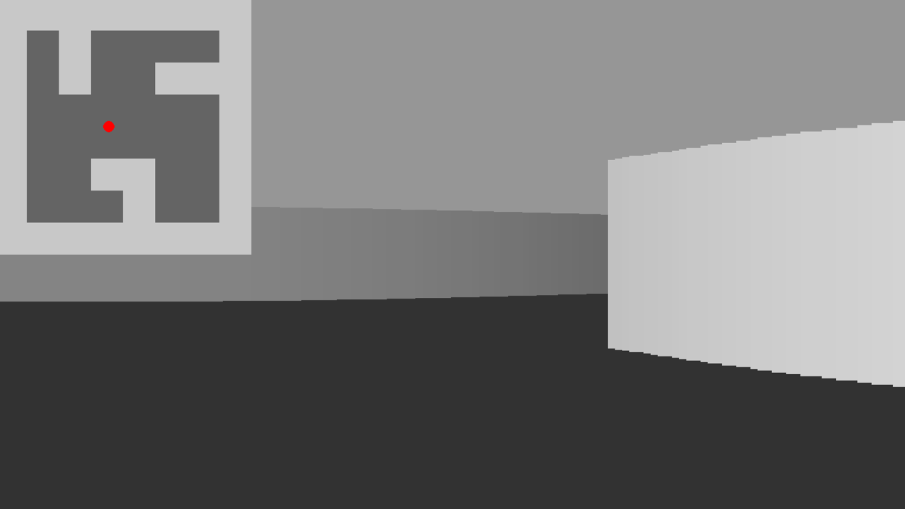

# Raycaster In Python

  

--- 
### This is a very basic raycaster made with python and pygame. You can move around with the ´arrow keys´, there are no collisions or textures. The shading is dept based. 
--- 

> 📌 If you want to know what a __*raycaster*__ is, check out this page:
https://lodev.org/cgtutor/raycasting.html